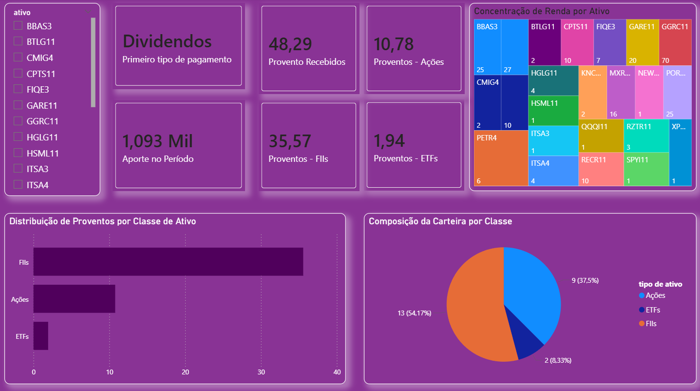

# analise-proventos-investimentos

💰 Análise de Proventos de Investimentos

Projeto desenvolvido com o objetivo de analisar o desempenho de uma carteira de investimentos com foco em geração de renda passiva (proventos).

🎯 Objetivo

Avaliar a evolução dos proventos ao longo do tempo e identificar padrões de rendimento da carteira.

🛠️ Ferramentas utilizadas
Excel
Power BI

📊 Análises realizadas
Evolução dos proventos ao longo do tempo
Distribuição dos rendimentos
Comparação entre períodos

📷 Dashboard

⚠️ Observação

Os dados foram ajustados/simulados para fins educacionais e preservação de privacidade.

📌 Sobre mim

Estou em transição para a área de dados, desenvolvendo projetos práticos com foco em análise de dados e geração de insights.
